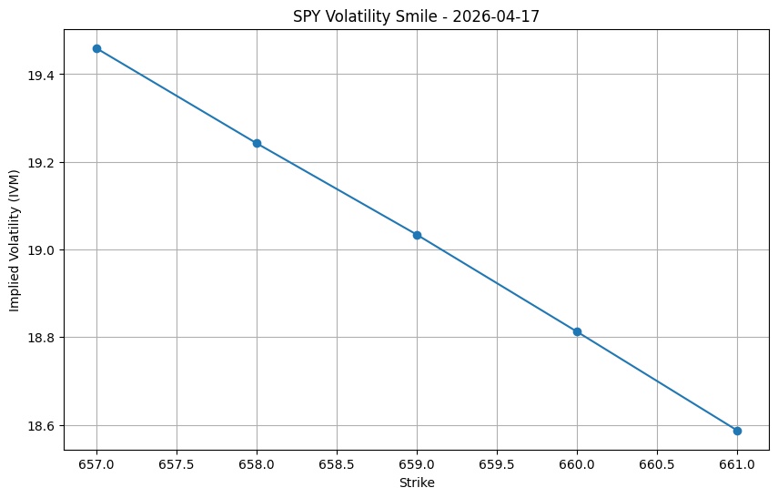
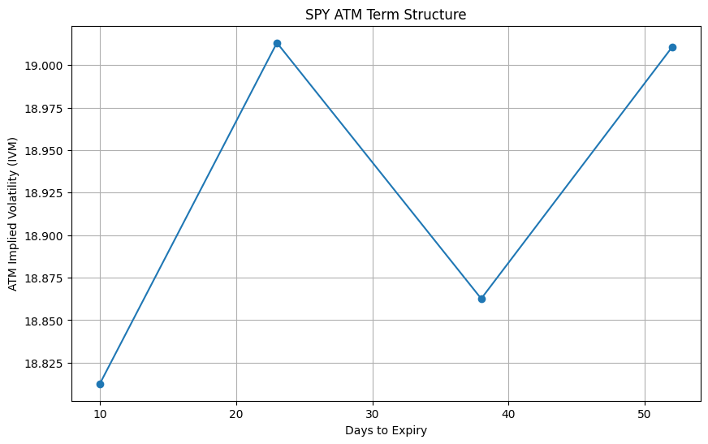
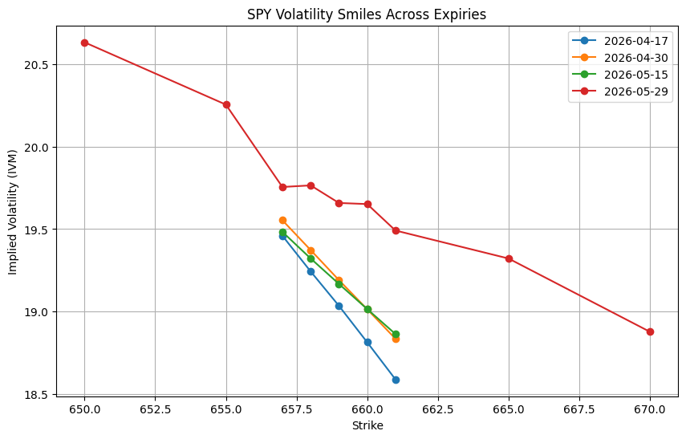
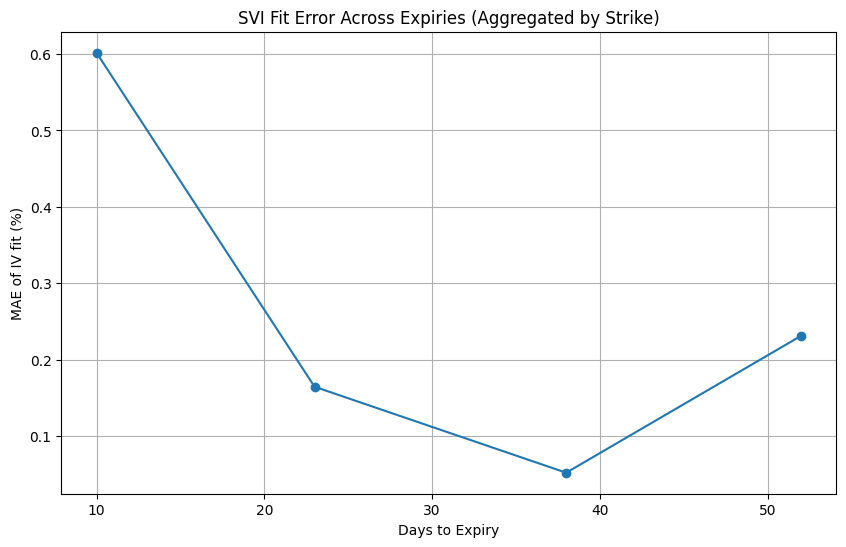
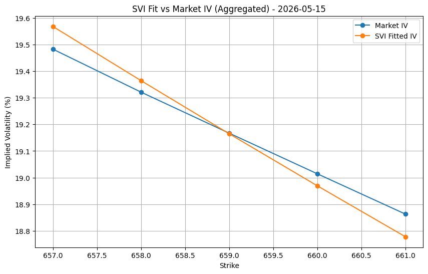

# SPY Options Volatility Surface Modeling

A research-style Python project for parsing Bloomberg option chain exports, cleaning SPY options data, analysing implied volatility structure, and calibrating raw SVI slices across expiries.

Repository focuses on the practical workflow behind volatility surface construction: quote filtering, smile and skew analysis, ATM term structure, cross-expiry comparison, and slice-by-slice SVI fitting in total variance space.

## Project Overview

Implied volatility surfaces are central to options pricing, risk management, and volatility trading.  
This project uses Bloomberg SPY options snapshot data to study how implied volatility behaves across strikes and maturities, and to test how well raw SVI can fit sparse listed-options data.

The workflow covers:

- parsing Bloomberg option chain exports
- cleaning call and put quote blocks
- liquidity-aware filtering
- volatility smile and skew visualisation
- ATM term structure construction
- call-vs-put comparison
- implied volatility heatmap generation
- raw SVI calibration across expiries
- automated validation reporting

## Key Findings

- The nearest-expiry smile exhibits a clear negative skew, with implied volatility decreasing as strike increases.
- The ATM term structure is close to flat, with only mild variation across the available expiries.
- SVI fit quality is strongest for mid-term expiries and weakest for the shortest maturity, where strike coverage is sparse.
- Aggregating observations by strike reduces microstructure noise and improves calibration stability, especially for longer maturities.
- The current dataset is sufficient for slice-based smile analysis, but still too sparse for a fully robust arbitrage-free surface reconstruction.

## Example Outputs

### Volatility Smile (Nearest Expiry)


### ATM Term Structure


### Smiles Across Expiries


### SVI Fit Error Across Expiries


### SVI Fit vs Market IV


## Methodology

### 1. Data Parsing
Bloomberg option chain exports are parsed into a structured tabular format, with expiry date, days to expiry, forward level, strike, quote fields, implied volatility, and option type extracted from the raw CSV layout.

### 2. Data Cleaning
The pipeline converts fields to numeric types, removes malformed rows, and computes derived quote quality measures such as:

- mid price
- bid-ask spread
- relative spread

Rows with invalid or illiquid quotes are filtered out using basic consistency checks.

### 3. Exploratory Volatility Analysis
The cleaned data is used to study:

- nearest-expiry volatility smile
- call vs put implied volatility comparison
- ATM term structure
- cross-expiry smile behavior
- strike-expiry heatmap of implied volatility

### 4. Raw SVI Calibration
For each expiry slice, the project transforms market IV into total variance:

- \( T = \text{days to expiry} / 365 \)
- \( k = \ln(K/F) \)
- \( w = \sigma^2 T \)

Raw SVI parameters are then calibrated with `scipy.optimize.minimize` using the L-BFGS-B algorithm.

### 5. Validation
The repo includes automated diagnostics for each expiry:

- number of raw points
- number of unique strikes
- IV fit MAE / RMSE
- parameter values
- simple rule-based validation flags

## Repository Structure

```text
src/
  clean_data.py
  build_filtered_options_dataset.py
  plot_smile.py
  plot_multi_smiles.py
  plot_call_put_comparison.py
  plot_atm_term_structure.py
  plot_iv_heatmap.py
  prepare_svi_slice.py
  fit_svi_slice.py
  fit_svi_all_expiries.py
  fit_svi_all_expiries_aggregated.py
  plot_svi_all_expiries.py
  plot_svi_all_expiries_aggregated.py
  validation_report.py

data/raw/         # raw Bloomberg exports (not tracked)
data/processed/   # cleaned / filtered datasets (not tracked)
outputs/          # charts, fitted data, validation outputs (not tracked)
```

## How to Run

Install dependencies:

```bash
pip install -r requirements.txt
```

Suggested workflow:

```bash
python src/clean_data.py
python src/build_filtered_options_dataset.py

python src/plot_smile.py
python src/plot_multi_smiles.py
python src/plot_call_put_comparison.py
python src/plot_atm_term_structure.py
python src/plot_iv_heatmap.py

python src/prepare_svi_slice.py
python src/fit_svi_slice.py

python src/fit_svi_all_expiries.py
python src/fit_svi_all_expiries_aggregated.py

python src/plot_svi_all_expiries.py
python src/plot_svi_all_expiries_aggregated.py
python src/validation_report.py
```

## Current Limitations

- The analysis uses snapshot Bloomberg data, not a dense live option surface.
- Several expiries have only 5 unique strikes, which limits smile curvature recovery.
- The current implementation fits raw SVI slices, but does not yet enforce full static arbitrage constraints across the surface.
- Surface interpolation is still preliminary; the project currently focuses more on slice quality and diagnostics than on full production-grade surface construction.

## Next Steps

- add stronger no-arbitrage checks
- introduce weighted calibration (e.g. by spread, volume, or vega)
- improve ATM interpolation instead of using a single nearest strike
- extend from slice-based analysis to a smoother strike-maturity surface
- compare raw SVI with more constrained arbitrage-aware approaches

